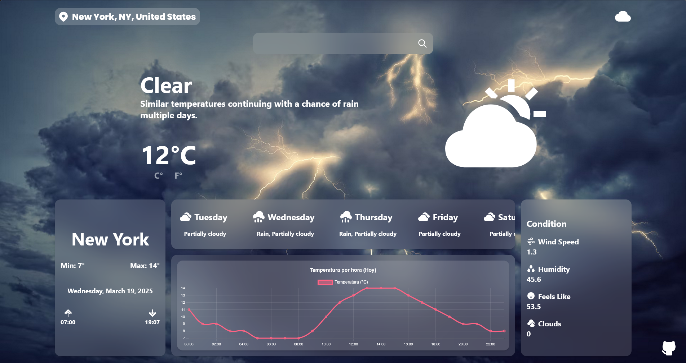

# ⛈️ Weather App - Tu Pronóstico del Tiempo Favorito ☀️



## 🌟 Características Principales

- **Pronóstico en tiempo real** - Obtén datos meteorológicos actualizados de cualquier ciudad del mundo
- **Visualización de temperatura por hora** - Gráficos interactivos que muestran la temperatura a lo largo del día
- **Soporte para Fahrenheit y Celsius** - Cambia entre unidades de temperatura según tus preferencias
- **Pronóstico de 5 días** - Planifica tu semana con previsiones meteorológicas detalladas
- **Diseño responsivo** - Experiencia perfecta en cualquier dispositivo
- **Interfaz elegante** - Diseño moderno con efectos de vidrio (glassmorphism)

## 🚀 Tecnologías Utilizadas

- **React** - Biblioteca de JavaScript para construir interfaces de usuario
- **Vite** - Herramienta de compilación ultrarrápida para desarrollo moderno
- **Tailwind CSS** - Framework CSS utility-first para diseño rápido y responsivo
- **Chart.js** - Biblioteca para crear gráficos interactivos
- **React Router** - Enrutamiento declarativo para aplicaciones React
- **Visual Crossing Weather API** - API de datos meteorológicos precisos y completos

## 🛠️ Instalación y Uso

1. Clona este repositorio:
   ```bash
   git clone https://github.com/JunLovin/weather-app.git
   cd weather-app
   ```

2. Instala las dependencias:
   ```bash
   npm install
   ```

3. Crea un archivo `.env.local` en la raíz del proyecto y añade tu API key:
   ```
   VITE_API_KEY=TU_API_KEY
   ```

4. Inicia la aplicación:
   ```bash
   npm run dev
   ```

5. Abre tu navegador y visita `http://localhost:5173`

## 🌐 Demo en Vivo

Visita la [demo en vivo](https://weather-app-kappa-ashen-15.vercel.app/) para probar la aplicación.

## 🤝 Contacto

¿Tienes preguntas o sugerencias? ¡Contáctame!

- Email: mathiassaid7@gmail.com


### ⭐ ¡No olvides dejar una estrella si te gustó este proyecto! ⭐
